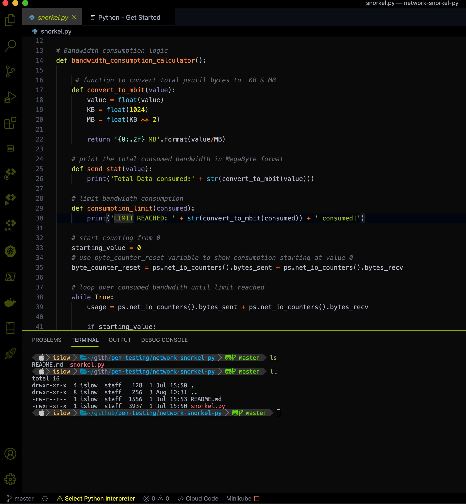

# Pretty-OS

This repository contains a collection of desktop beautifiers for your linux operating systems.

## Motivation

Attempting to minimise the amount of time I repeadly invest in beautifying my system OS.

## Look

## License

This repository is published under the MIT License
