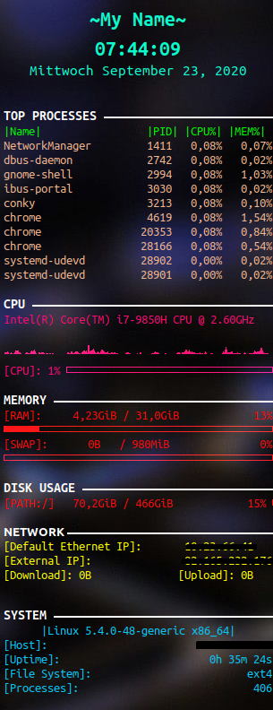

# Pretty-OS

This repository contains a collection of desktop beautifiers for your linux operating systems.

## Motivation

Attempting to minimise the amount of time I repeadly invest in beautifying my OS system.

## Look

<h4 style="text-decoration: underline;">[VS Code Theme]</h4>
     
<h4 style="text-decoration: underline;">[Desktop Look]</h4>
     
<h4 style="text-decoration: underline;">[Conky]</h4>
    

## License

This repository is published under the MIT License
