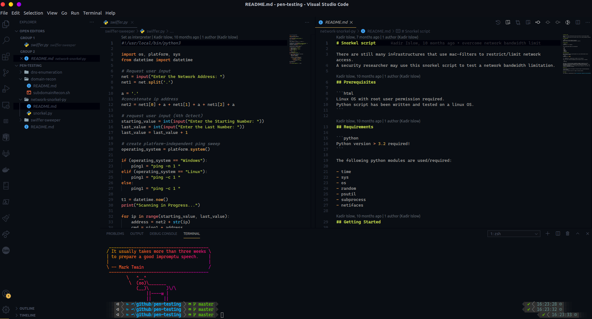

# Pretty-OS

The repository consists of a collection of desktop beautifiers for your Linux OS.
While these scripts have been tested only on **Ubuntu**, they ought to work on every debian-based system as well.

## Motivation

Trying to minimise the amount of time I spend constantly tweaking my OS.

## Look

<h4 style="text-decoration: underline;">[VS Code Theme]</h4>
     
<h4 style="text-decoration: underline;">[Desktop Look]</h4>
     
<h4 style="text-decoration: underline;">[Conky]</h4>
    

## License

This repository is published under the MIT License
