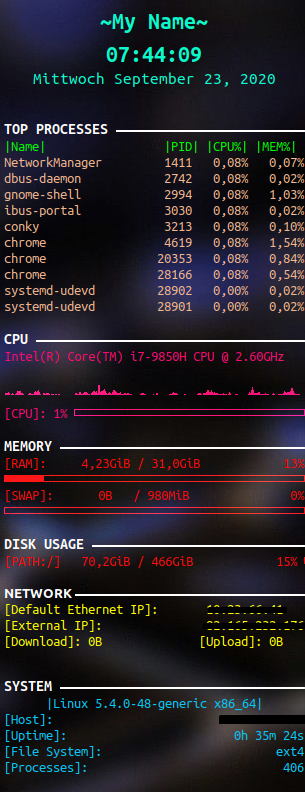

# Conky - Real time system info for your Linux desktop 

Conky is a graphical tool for Linux that displays system information to your screen in real time.

## Motivation

One can use conky-manager to tweak system info, however I prefer a light weight solution without having to install a bunch of dependcies.
Hence, I have installed conky and tweaked the .conkyrc file.

## Example

<p align="left">
  
</p>

## Getting Started

Open your preferred terminal:

```bash
$ sudo apt install conky-all
```

Execute python script:

```bash
$ ./script.py
```

## todo

- add to startup (py script)
- customise conky (cp /etc/conky/conky.conf ~/.conkyrc)
- copy /gitlab/conkyrc/conkyrc to ~/.conkyrc

## License

This repository is published under the [MIT License](https://opensource.org/licenses/MIT)