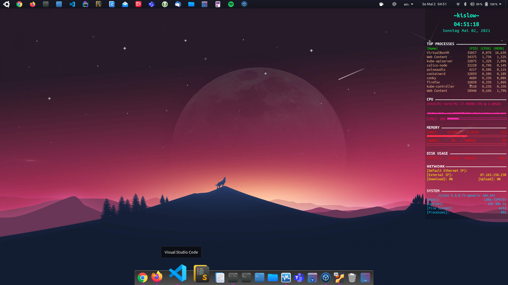

# Plank dock - Lightweight linux dock

Plank is meant to be the simplest dock on the planet. The goal is to provide
just what a dock needs and absolutely nothing more.

## Example

<p align="left">
  
</p>

## Getting Started

Clone repository to your local device and run the following command:

```bash
$ make install
```

To remove conky, run the following command:

```bash
$ make remove
```

## License

This repository is published under the [MIT License](https://opensource.org/licenses/MIT)
