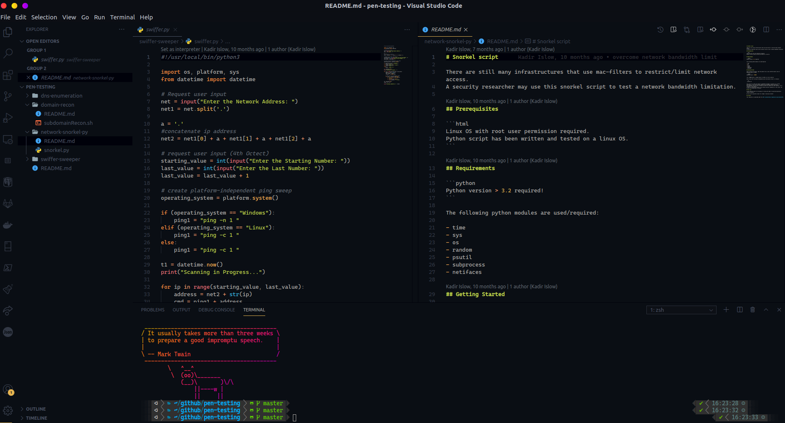

# Visual Studio Code Theme + Extensions

Install VSCode + ayu dark lighter theme

## Look

<p align="left">
  
</p>

## Getting Started

Clone repository and execute the following command:


```bash
$ make install
```

To remove all vscode extensions, run the following command:

```bash
$ make remove
```

Note: `Warning: apt-key is deprecated. Manage keyring files in trusted.gpg.d instead (see apt-key(8)).` needs to be fixed manually.
## License

This repository is published under the [MIT License](https://opensource.org/licenses/MIT)